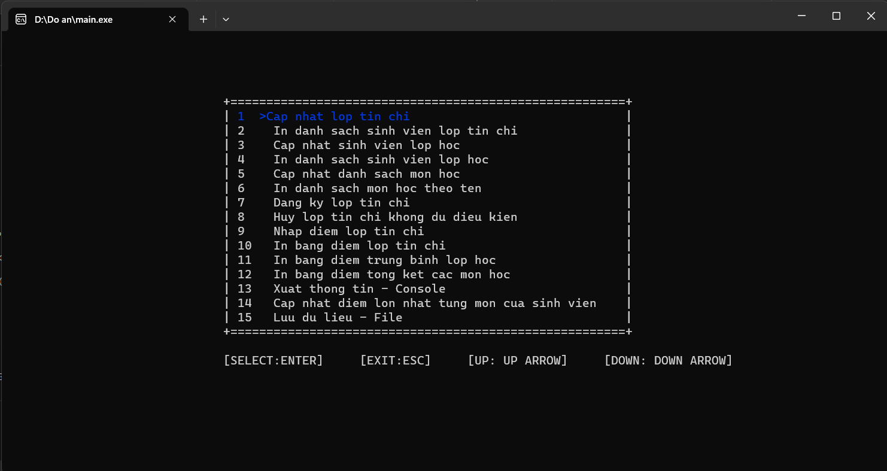
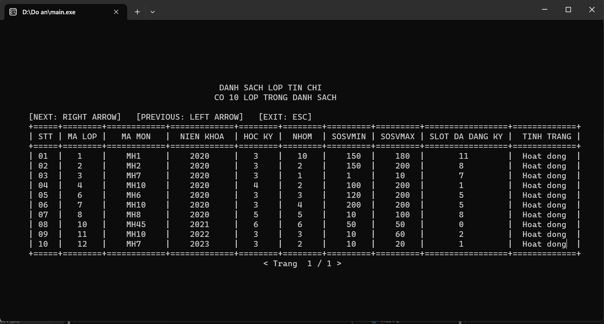
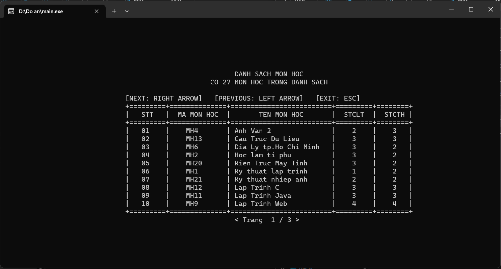
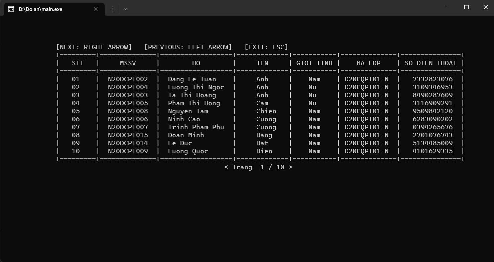
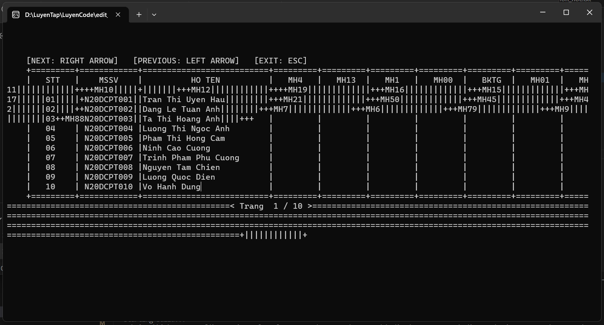
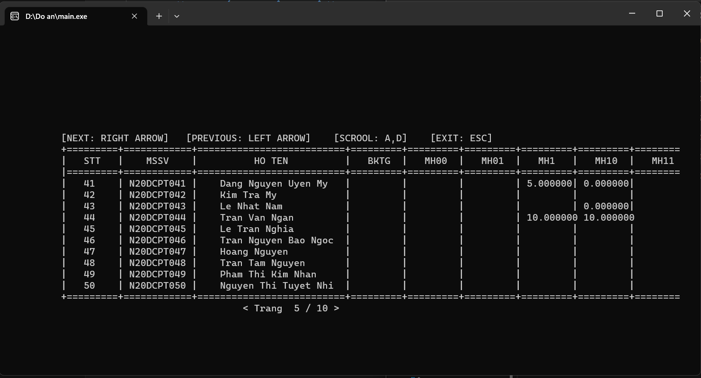

# **ĐỒ ÁN MÔN CẤU TRÚC DỮ LIỆU VÀ GIẢI THUẬT 👋**
* Giảng viên hướng dẫn: Thầy Lưu Nguyễn Kỳ Thư
* Sinh viên thực hiện: Trần Văn Ngạn
* Thời gian: Kỳ 2 - 2022

_**Hôm nay dọn máy tính chợt thấy repo này. Đây là [đồ án môn Cấu trúc dữ liệu và giải thuật ](https://github.com/ngantrandev/Data-Structure-and-Algorithms) hồi năm hai**_  
_**Đợt đó project chạy ngon lành. Nhưng hôm nay mở lên bị lỗi giao diện chức năng "In điểm tổng kết" được trình bày trong [mục 4](#4-lỗi-xảy-ra-và-cách-khắc-phục).**_  
_**Vì vậy, hôm nay mình ngồi lại sửa chức năng in giao diện đó. Còn lại thì không có gì thay đổi.**_

# 🚀 Sử dụng
> * Ngôn ngữ lập trình: C & C++
> * Cấu trúc dữ liệu: Linked List, Stack, Tree..

## **Mục lục**
[**1. Công cụ và cách cài đặt**](#1công-cụ)  
[**2. Cấu trúc thư mục**](#2-cấu-trúc-thư-mục)  
[**3. Một số hình ảnh của project**](#3-một-số-hình-ảnh-của-project)  
[**4. Lỗi xảy ra và cách khắc phục**](#4-lỗi-xảy-ra-và-cách-khắc-phục)


# [**1. Công cụ và cách cài đặt**](công-cụ) 

### **Đây là công cụ mình dùng cho project này**  

* Công cụ:
  * Hệ điều hành: Windows 10 hoặc 11
  * Visual Studio Code ( Bản nào cũng được)
    * Trong VSCode cài thêm extension: C/C++ và Code Runner
  * Cài thêm MinGW để chạy được C/C++

### **Cách cài đặt**
* Cài đặt VSCode và MinGW
* Cấu hình biến môi trường cho MinGW
* Mở thư mục chứa project này bằng VSCode
* Build file main.cpp bằng Code Runner ( hoặc bằng dòng lệnh nếu muốn)
> $ g++ -o \<fileName.exe> maNguon.cpp

# [**2. Cấu trúc thư mục**](#2-cấu-trúc-thư-mục)  
```
├── data
|   └── txt_file: file data mẫu
|
├── picture: Một số hình ảnh của project
|
├── src
|   ├── algorithms.h : Chứa các thuật toán sắp xếp, xóa, tìm kiếm
|   |
|   ├── basic.h : Chứa các hàm xử lý chuỗi cơ bản
|   |
|   ├── data_manager.h : Chứa các hàm xử lý file (load data, save data, ...)
|   |
|   ├── view : Thư mục chứa các thư viện thao tác với console và giao diện
|   |
|   ├── config.h: Chứa các hằng số và cấu hình project
|   |
|   └── struct.h: Chứa định nghĩa các cấu trúc dữ liệu
|
├── main.cpp: file mã nguồn chính
|
└── README.md
```

# [**3. Một số hình ảnh của project**](#3-một-số-hình-ảnh-của-project)  
### **Menu chính**


### **Menu chức năng**

  - ###### **IN DANH SÁCH LOP TIN CHI**
    
  - ###### **IN DANH SÁCH MÔN HỌC THEO TÊN**
    
  - ###### **IN DANH SÁCH SINH VIÊN THEO TÊN**
    

# [**4. Lỗi xảy ra và cách khắc phục**](#4-lỗi-xảy-ra-và-cách-khắc-phục)

Phía trên là những hình ảnh của project khi chạy ngon lành trên máy cũ của mình. Rất may là bữa đi trả bài thầy không dính lỗi giao diện.

### Tuy nhiên, khi chạy trên máy mới thì gặp lỗi giao diện như sau:
* 

* Có thể là do lỗi bộ đệm console. Thông tin in ra vượt giới hạn console khiến cho nó bị đẩy xuống dòng tiếp theo. Hồi đó, với máy cũ thì hoàn toàn có thể tăng kích thước bộ đệm console lên để khắc phục. Nhưng với máy mới thì không được.

### CÁCH KHẮC PHỤC:
  * Giới hạn kích thước biên màn hình cho phù hợp với màn hình hiện tại với các giá trị đặt trong file config.h:

    > __  
    > const int MIN_CONSOLE_X = 0;  
    > const int MIN_CONSOLE_Y = 0;  
    > const int MAX_CONSOLE_X = 118;  
    > const int MAX_CONSOLE_Y = 30;  
    > const int SCROOL_STEP = 10;  
    > __


  * Tạo hàm riêng để put text và in bảng lên console trong giới hạn console đã đặt.

* Kết quả
  * 
  * Thông tin vượt quá console sẽ bị cắt bớt và không được in ra.
  * Để xem chi tiết thì có thể dùng phím tắt A hoặc D để scroll qua lại.

---------------------------------------  
---------------------------------------

[Powered by ❤️ TRAN VAN NGAN](https://github.com/ngantrandev)


